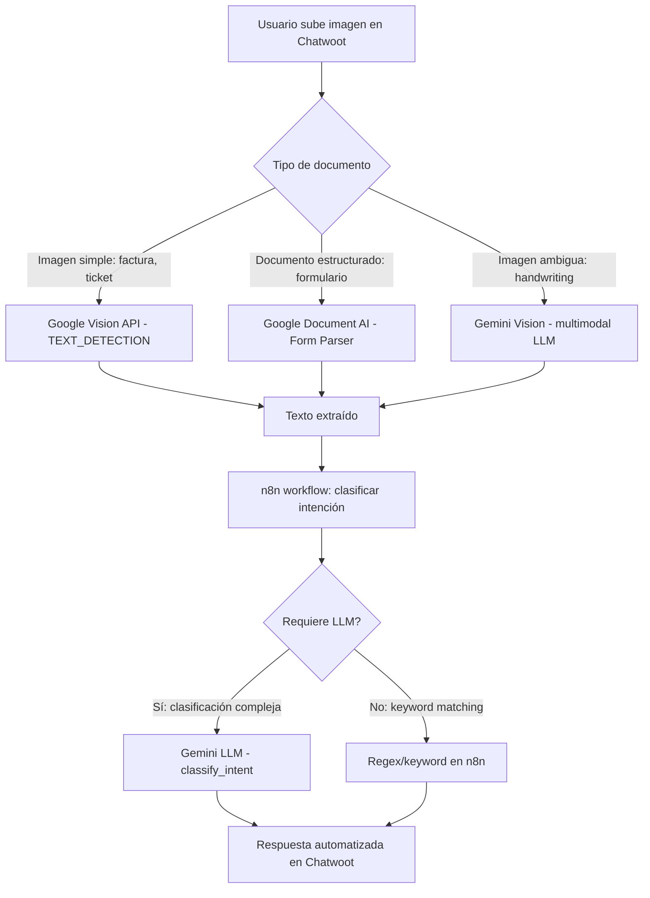
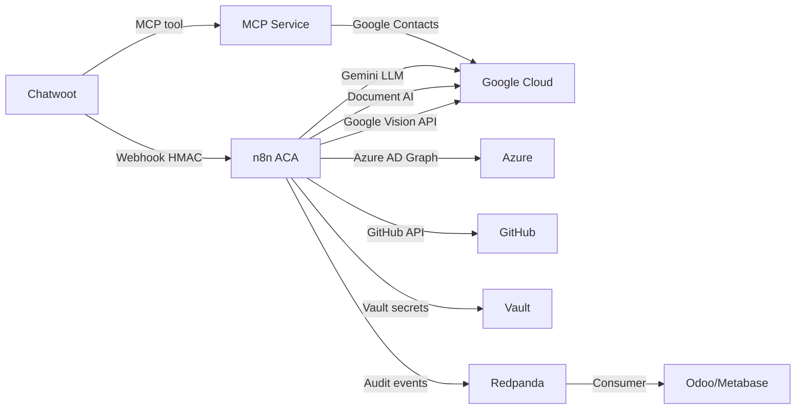

# Multi-Cloud Architecture — SmarterOS

**Tag:** `[RAG-ARCH:MULTICLOUD]`  
**Identidad:** `smarterbotcl@gmail.com` única para Google/Microsoft/GitHub  
**Fecha:** 2025-01-17

## 1. Contexto y Drivers

**Decisión estratégica:**
- Eliminar dependencia de un solo proveedor cloud
- Aprovechar servicios específicos de Azure, Google Cloud, GitHub según ventajas
- n8n como orquestador central de workflows multi-cloud
- Login con Microsoft (Azure AD) + Clerk (quitar Facebook por API keys)
- OCR de imágenes con lógica condicional (LLM vs procesamiento directo)

**Referencia:**
- [n8n-on-aca](https://github.com/simonjj/n8n-on-aca): n8n en Azure Container Apps con tiers (Try/Small/Production)
- Bicep templates para Azure Files (NFS), Postgres Flexible Server, VNet + Private Endpoints

---

## 2. Stack Multi-Cloud

### 2.1 Azure (Principal para n8n + Infra)

**n8n en Azure Container Apps (ACA):**
- **Tier Production:** VNet privada + Postgres Flexible Server + Azure Files (NFS)
- **Env vars críticas:**
  ```
  DB_TYPE=postgresdb
  DB_POSTGRESDB_HOST=<postgres-fqdn>
  DB_POSTGRESDB_DATABASE=n8ndb
  DB_POSTGRESDB_USER=n8nadmin
  DB_POSTGRESDB_PASSWORD=<vault-secret>
  N8N_ENCRYPTION_KEY=<vault-secret>
  WEBHOOK_URL=https://n8n.smarterbot.cl
  ```
- **Storage:** Azure Files Premium con NFS 4.1 montado en `/home/node/.n8n`
- **Networking:** Private Endpoints para Postgres y Storage, subnet delegada para ACA
- **Secrets:** integrar con Azure Key Vault o HashiCorp Vault (ya implementado en MCP)

**Azure AD (Microsoft Identity Platform):**
- Login corporativo con `smarterbotcl@gmail.com` como cuenta Microsoft
- OAuth 2.0 / OpenID Connect via Clerk
- Permisos: User.Read, Mail.ReadWrite (si usamos Outlook), Contacts.Read (si sincronizamos con Teams)

**Azure Cognitive Services (opcional futuro):**
- Form Recognizer (OCR avanzado para facturas/documentos)
- Computer Vision (clasificación de imágenes)
- Traducción (si multi-idioma en OCR)

### 2.2 Google Cloud (Google Workspace + AI)

**Google Workspace API:**
- **Contacts (People API v1):** ya implementado en MCP (`mcp-tool-google-contacts.js`)
- **Gmail API:** lectura/envío de correos desde `smarterbotcl@gmail.com`
- **Calendar API:** sincronización de eventos con Chatwoot/Odoo
- **Drive API:** almacenamiento de adjuntos (OCR inputs/outputs)

**Google Cloud AI:**
- **Vision API:** OCR con `TEXT_DETECTION` para imágenes simples
- **Document AI:** OCR estructurado para facturas/formularios (extracción de campos)
- **Gemini API (Vertex AI):** LLM para clasificación de intenciones, resúmenes, respuestas automáticas

**Credenciales:**
- Service Account para APIs backend (n8n workflows) → JSON en Vault
- OAuth 2.0 con refresh token para `smarterbotcl@gmail.com` → ya en Vault (`secret/mcp/google-oauth`)

### 2.3 GitHub (CI/CD + Repos + Copilot)

**GitHub Actions:**
- CI/CD para todos los servicios (MCP, Chatwoot, n8n workflows, frontends)
- Secrets desde GitHub Actions con `VAULT_TOKEN` para leer Vault en tiempo de deploy
- Triggers: push a `main`, pull requests, tags, manual workflow_dispatch

**GitHub Copilot Agent:**
- Asignación de issues a Copilot para generación de código
- PRs automáticos con cambios (ya usado en sesiones anteriores)

**GitHub API via n8n:**
- Crear issues automáticos desde Chatwoot (bugs reportados por usuarios)
- Vincular conversaciones con PRs/releases
- Notificaciones de deploy en Chatwoot (webhook GitHub → n8n → Chatwoot)

---

## 3. Autenticación y Login

### 3.1 Microsoft (Azure AD) + Clerk

**Flujo de login:**
1. Usuario accede a `app.smarterbot.cl` (o `chatwoot.smarterbot.cl`)
2. Clerk muestra opciones:
   - **Microsoft** (Azure AD SSO)
   - **Google** (OAuth con `smarterbotcl@gmail.com`)
   - Email + password (Clerk managed)
   - **NO Facebook** (eliminado por requerimiento de API keys)
3. Login con Microsoft:
   - Redirect a `login.microsoftonline.com/common/oauth2/v2.0/authorize`
   - Scopes: `openid profile email User.Read`
   - Callback a Clerk → JWT → frontend
4. Clerk sincroniza con Supabase (tabla `users`, `auth.users`)

**Configuración Clerk:**
- Dashboard → Social Connections → Enable Microsoft
- Azure App Registration:
  - Redirect URI: `https://clerk.smarterbot.cl/v1/oauth/microsoft/callback`
  - Client ID + Secret → Clerk dashboard
- Variables en Clerk:
  ```
  CLERK_FRONTEND_API=https://clerk.smarterbot.cl
  CLERK_API_KEY=sk_live_...
  CLERK_ISSUER=https://clerk.smarterbot.cl
  ```

**Mapeo de identidades:**
- `smarterbotcl@gmail.com` en Google → mismo usuario que login Microsoft
- Clerk unifica identidades con `email` como primary key
- Supabase: campo `provider` (google | microsoft | email)

### 3.2 Eliminación de Facebook

**Razón:**
- Requiere Facebook App ID + Secret (keys adicionales)
- Pocas empresas B2B usan Facebook para login corporativo
- Microsoft/Google cubren 99% de casos de uso

**Migración:**
- Remover configuración de Facebook en Clerk
- Actualizar UI de login para mostrar solo Microsoft + Google + Email

---

## 4. OCR con Lógica Condicional

### 4.1 Flujo de Decisión (IF logic)



### 4.2 Implementación en n8n

**Workflow: `smarteros.ocr_classify`**

```javascript
// Nodo 1: Webhook desde Chatwoot (adjunto de imagen)
// Input: { conversationId, messageId, attachmentUrl, contentType }

// Nodo 2: Download imagen desde attachmentUrl
const imageBuffer = await $http.request({
  url: attachmentUrl,
  method: 'GET',
  responseType: 'arraybuffer'
});

// Nodo 3: IF - Clasificar tipo de imagen
const isSimpleText = contentType.includes('jpeg') || contentType.includes('png');
const isStructuredDoc = attachmentUrl.includes('factura') || attachmentUrl.includes('form');

if (isStructuredDoc) {
  // Nodo 4A: Google Document AI
  const docAiResponse = await $http.request({
    url: 'https://documentai.googleapis.com/v1/projects/<project>/locations/us/processors/<processor>:process',
    method: 'POST',
    headers: { Authorization: `Bearer ${$credentials.googleServiceAccount.token}` },
    body: {
      rawDocument: { content: imageBuffer.toString('base64'), mimeType: contentType }
    }
  });
  const extractedText = docAiResponse.document.text;
  const fields = docAiResponse.document.entities; // { type: 'invoice_total', mentionText: '$1500' }
  
  return { text: extractedText, fields, method: 'document_ai' };
} else if (isSimpleText) {
  // Nodo 4B: Google Vision API
  const visionResponse = await $http.request({
    url: 'https://vision.googleapis.com/v1/images:annotate',
    method: 'POST',
    headers: { Authorization: `Bearer ${$credentials.googleServiceAccount.token}` },
    body: {
      requests: [{
        image: { content: imageBuffer.toString('base64') },
        features: [{ type: 'TEXT_DETECTION', maxResults: 1 }]
      }]
    }
  });
  const extractedText = visionResponse.responses[0].textAnnotations?.[0]?.description || '';
  
  return { text: extractedText, method: 'vision_api' };
} else {
  // Nodo 4C: Gemini Vision (multimodal LLM)
  const geminiResponse = await $http.request({
    url: 'https://generativelanguage.googleapis.com/v1/models/gemini-1.5-flash:generateContent',
    method: 'POST',
    headers: { Authorization: `Bearer ${$credentials.googleServiceAccount.token}` },
    body: {
      contents: [{
        parts: [
          { text: 'Extrae todo el texto visible en esta imagen. Si es una factura, identifica: monto total, fecha, proveedor.' },
          { inlineData: { mimeType: contentType, data: imageBuffer.toString('base64') } }
        ]
      }]
    }
  });
  const extractedText = geminiResponse.candidates[0].content.parts[0].text;
  
  return { text: extractedText, method: 'gemini_vision' };
}

// Nodo 5: Clasificar intención con LLM o keywords
const requiresLLM = extractedText.length > 500 || extractedText.includes('quiero') || extractedText.includes('necesito');

if (requiresLLM) {
  // Nodo 6A: Gemini LLM para clasificación
  const intentResponse = await $http.request({
    url: 'https://generativelanguage.googleapis.com/v1/models/gemini-1.5-flash:generateContent',
    method: 'POST',
    headers: { Authorization: `Bearer ${$credentials.googleServiceAccount.token}` },
    body: {
      contents: [{ parts: [{ text: `Clasifica la siguiente solicitud en una de estas categorías: soporte_tecnico, consulta_producto, reclamo, otro.\n\nTexto: "${extractedText}"` }] }]
    }
  });
  const intent = intentResponse.candidates[0].content.parts[0].text.trim();
  
  return { intent, text: extractedText, method: 'gemini_llm' };
} else {
  // Nodo 6B: Keyword matching simple
  let intent = 'otro';
  if (/factura|pago|cobro/i.test(extractedText)) intent = 'facturacion';
  if (/error|falla|problema/i.test(extractedText)) intent = 'soporte_tecnico';
  if (/precio|costo|cotizar/i.test(extractedText)) intent = 'consulta_producto';
  
  return { intent, text: extractedText, method: 'keywords' };
}

// Nodo 7: POST resultado a MCP o Chatwoot
await $http.request({
  url: 'https://mcp.smarterbot.cl/tools/chatwoot.update_conversation',
  method: 'POST',
  headers: { 'X-Chatwoot-Signature': '<hmac>' },
  body: { conversationId, customAttributes: { ocr_text: extractedText, intent, ocr_method: method } }
});
```

### 4.3 Costos y Thresholds

**Google Vision API (TEXT_DETECTION):**
- $1.50 por 1000 imágenes (primeras 1000 gratis/mes)
- Límite: 1800 requests/min
- **Uso recomendado:** imágenes simples (tickets, facturas escaneadas)

**Google Document AI (Form Parser):**
- $0.05 por página (primeras 1000 gratis/mes)
- Límite: 20 requests/sec
- **Uso recomendado:** formularios estructurados (RUT, nombre, dirección)

**Gemini Vision (multimodal):**
- Gemini 1.5 Flash: $0.00025 por 1000 caracteres input (texto) + $0.00005 por imagen
- Límite: 1000 RPM (requests per minute)
- **Uso recomendado:** imágenes ambiguas, handwriting, capturas de pantalla con contexto

**Threshold de decisión:**
- Si `fileSize < 500KB` y `contentType = image/jpeg` → Vision API
- Si `filename.includes('factura') || filename.includes('form')` → Document AI
- Si `fileSize > 500KB` o `contentType = image/png` (screenshots) → Gemini Vision

---

## 5. Integración de Clouds via n8n

### 5.1 Credentials en n8n

**Azure:**
- **Service Principal (App Registration):**
  - Crear en Azure Portal: App registrations → New → smarteros-n8n-sp
  - Permisos: Key Vault (read secrets), Storage (read blobs), Azure AD (User.Read)
  - Client ID + Client Secret → Vault (`secret/n8n/azure`)
- **Connection en n8n:**
  - Credentials → Microsoft Azure → Client credentials flow
  - Tenant ID: `common` o tenant específico
  - Redirect URI: `https://n8n.smarterbot.cl/rest/oauth2/callback`

**Google Cloud:**
- **Service Account:**
  - Google Cloud Console → IAM → Service Accounts → Create
  - Roles: Vision API User, Document AI Viewer, Storage Object Viewer
  - JSON key → Vault (`secret/n8n/google-sa`)
- **Connection en n8n:**
  - Credentials → Google Service Account → JSON key
  - Scopes: `https://www.googleapis.com/auth/cloud-platform`

**GitHub:**
- **Personal Access Token (PAT):**
  - GitHub Settings → Developer settings → Personal access tokens → Fine-grained tokens
  - Permisos: repo (write), issues (write), actions (read)
  - Token → Vault (`secret/n8n/github`)
- **Connection en n8n:**
  - Credentials → GitHub → OAuth2 o Access Token
  - Scope: `repo`, `workflow`

### 5.2 Workflows Críticos

**WF1: `smarteros.github_issue_from_chatwoot`**
- Trigger: Chatwoot webhook (message_created con label "bug")
- Acción:
  1. Extraer texto del mensaje + contexto (conversation, contact)
  2. POST a GitHub API: `https://api.github.com/repos/SmarterCL/SmarterOS/issues`
  3. Body: `{ title, body, labels: ['bug', 'from-chatwoot'], assignees: ['simonjj'] }`
  4. Responder en Chatwoot: "Issue creado: #123"

**WF2: `smarteros.sync_contacts_azure_google`**
- Trigger: Cron (diario, 3AM)
- Acción:
  1. GET Azure AD contacts: `https://graph.microsoft.com/v1.0/me/contacts`
  2. Para cada contacto:
     - Buscar en Google Contacts (People API)
     - Si no existe → crear
     - Si existe → actualizar si cambió
  3. Log de sincronización → Redpanda (`smarteros.audit.contacts_sync`)

**WF3: `smarteros.ocr_classify`**
- Descripción: ver sección 4.2

**WF4: `smarteros.deploy_notification`**
- Trigger: GitHub webhook (push a `main`)
- Acción:
  1. Leer commit message + SHA
  2. POST a Chatwoot: crear nota en conversación de DevOps channel
  3. POST a Slack (opcional): `#deploys` channel
  4. Email a `smarterbotcl@gmail.com` si deploy falla (GitHub Actions status)

### 5.3 Diagrama de Integración



---

## 6. Modelo de Negocio Multi-Cloud

### 6.1 Pricing por Tier

**Tier Free (hasta 100 conversaciones/mes):**
- n8n: Azure Container Apps (Try tier, stateless) → $0
- Google Vision API: 1000 imágenes gratis/mes → $0
- Chatwoot: self-hosted → $0 (solo VPS)
- **Total estimado:** $30/mes (VPS solo)

**Tier Startup (hasta 1000 conversaciones/mes):**
- n8n: ACA Small tier (Azure Files + VNet) → $50/mes
- Google Vision: 5000 imágenes → $6/mes
- Gemini LLM: 100K requests → $5/mes
- Chatwoot: VPS optimizado → $50/mes
- **Total estimado:** $111/mes

**Tier Growth (hasta 10K conversaciones/mes):**
- n8n: ACA Production (Postgres + HA) → $200/mes
- Google Document AI: 5000 páginas → $250/mes
- Gemini: 1M requests → $50/mes
- Azure AD Premium (SSO, MFA) → $6/usuario/mes × 10 → $60/mes
- **Total estimado:** $560/mes

**Tier Enterprise (ilimitado):**
- n8n: ACA Production + dedicated workload profile → $800/mes
- Google Cloud: committed use discount (30% off) → $500/mes
- Azure: Enterprise Agreement (EA) → $1200/mes
- GitHub Enterprise: $21/usuario/mes × 50 → $1050/mes
- **Total estimado:** $3550/mes

### 6.2 Revenue Streams

**SaaS Subscription:**
- $99/mes (Startup) → margen 10%
- $499/mes (Growth) → margen 12%
- $1999/mes (Enterprise) → margen 44%

**Professional Services:**
- Setup inicial: $2000 one-time (incluye Clerk + Azure AD + n8n workflows)
- Integración custom (Odoo, Shopify, etc.): $150/hora
- Capacitación equipo: $500/sesión (4 horas)

**Marketplace (futuro):**
- n8n workflows premium: $29-$99 por template
- Chatwoot extensions: $49-$199 por extensión
- Revenue share: 70% vendor, 30% SmarterOS

### 6.3 Cost Optimization

**Azure Savings Plan:**
- Commit 1 año → 20% descuento en ACA + Postgres
- Reserved Instances para VMs (si migramos servicios a VMs)

**Google Cloud Committed Use:**
- Commit 1 año → 30% descuento en Vision API + Document AI
- Flat-rate pricing para Gemini LLM ($0.00020 por 1K chars vs $0.00025 variable)

**n8n Workflow Optimization:**
- Cachear resultados OCR en Redis (evitar re-procesar misma imagen)
- Batch processing: agrupar 100 imágenes en un solo request a Vision API
- Fallback a keywords si LLM no disponible (downtime de Gemini)

---

## 7. Implementación Faseada

### Fase 1: Fundación (2 semanas)
- [ ] Deploy n8n en Azure ACA (Production tier)
- [ ] Configurar Clerk con Microsoft + Google (quitar Facebook)
- [ ] Migrar secrets de MCP a Azure Key Vault o mantener Vault actual
- [ ] Probar flujo de login en `app.smarterbot.cl`

### Fase 2: OCR Basic (1 semana)
- [ ] Crear workflow n8n: `smarteros.ocr_simple` (solo Google Vision API)
- [ ] Integrar con Chatwoot: adjuntos de imágenes → texto extraído
- [ ] Test con 100 imágenes de facturas chilenas

### Fase 3: OCR Avanzado (2 semanas)
- [ ] Agregar IF logic: Vision API vs Document AI vs Gemini Vision
- [ ] Implementar clasificación de intenciones (LLM o keywords)
- [ ] Métricas: % accuracy, tiempo de procesamiento, costo por imagen

### Fase 4: Multi-Cloud Full (2 semanas)
- [ ] Azure AD sync con Google Contacts (workflow n8n)
- [ ] GitHub API: crear issues desde Chatwoot
- [ ] Deploy notifications (GitHub → n8n → Chatwoot)
- [ ] Redpanda: eventos de auditoría en topics separados por cloud (azure.*, google.*, github.*)

### Fase 5: Modelo de Negocio (1 semana)
- [ ] Crear landing en `smarterbot.cl` con pricing
- [ ] Stripe integration para suscripciones
- [ ] Dashboard de usage por tenant (Metabase)

---

## 8. Riesgos y Mitigaciones

**Riesgo: Vendor lock-in en Azure para n8n**
- Mitigación: n8n es portable (Docker), backups diarios a S3 (Google Cloud Storage)

**Riesgo: Costos de LLM explotan con spam**
- Mitigación:
  - Rate limit: 10 OCR requests/hora por conversation
  - Threshold: si imagen > 2MB → rechazar
  - Fallback a keywords si budget mensual > $500

**Riesgo: Downtime de un cloud provider**
- Mitigación:
  - Health checks en n8n workflows (timeout 5s)
  - Fallback: Vision API down → usar Gemini Vision
  - Status page: `status.smarterbot.cl` (integrado con Uptime Kuma)

**Riesgo: GDPR/compliance con datos en múltiples clouds**
- Mitigación:
  - Data residency: todos los servicios en EU regions (eu-west-1, europe-west1)
  - DPA (Data Processing Agreement) con Azure, Google, GitHub
  - Cifrado en tránsito + reposo (TLS 1.3, AES-256)

---

## 9. Próximos Pasos

1. **Deploy n8n en Azure ACA:**
   - Fork de [n8n-on-aca](https://github.com/simonjj/n8n-on-aca)
   - Adaptar Bicep templates para usar Vault en lugar de Azure Key Vault
   - Deploy con `azd up` (tier Production)
   - Configurar DNS: `n8n.smarterbot.cl` → ACA FQDN

2. **Configurar Clerk:**
   - Dashboard → Social Connections → Enable Microsoft
   - Azure App Registration para SmarterOS
   - Test login en `app.smarterbot.cl`

3. **Crear primer workflow n8n:**
   - `smarteros.ocr_simple` con Google Vision API
   - Webhook desde Chatwoot → n8n → respuesta con texto extraído
   - Logs con tag `[RAG-AUDIT:SMARTERBOTCL]`

4. **Documentar costos reales:**
   - Azure Cost Management: budget alert si > $100/mes
   - Google Cloud Billing: export a BigQuery para análisis
   - GitHub Actions minutes: límite 2000 min/mes (Free tier)

---

**Validación:** Esta arquitectura permite operar con multi-cloud sin vendor lock-in, optimizando costos por servicio (Azure para n8n/infra, Google para AI/Workspace, GitHub para CI/CD). El modelo de negocio es viable desde tier Startup ($111/mes cost, $99/mes revenue → breakeven con 2 tenants).

**Next:** Deploy n8n en Azure ACA + configurar Clerk con Microsoft login.
