# 🏗️ SmarterOS - Arquitectura Moderna 2025

**Versión**: v2025.11.30  
**Estado**: Production Ready  
**Autor**: Sistema SmarterOS  

---

## 🎯 Visión General

SmarterOS es un **Sistema Operativo Digital** que conecta negocios, ventas, pagos y automatización en un único flujo cognitivo. No es una aplicación SaaS tradicional, sino una **capa de conectividad inteligente** entre empresas y sus APIs.

### Principio Fundamental

> **Las empresas no suben código, solo exponen APIs que ya existen.**  
> SmarterMCP conversa directamente con ellas.

---

## 🏛️ Arquitectura de Capas

### Capa 0: Identity & Zero Trust (Cloudflare One)

**Componente**: Cloudflare Access + AI Controls

- **Access Policies** para todos los endpoints críticos
- **AI Controls** para MCP server portals
- **Linked Apps** para self-hosted applications
- **OIDC/SSO** integrado

**Referencias**:
- [Cloudflare Access Self-Hosted](https://developers.cloudflare.com/cloudflare-one/applications/configure-apps/self-hosted-apps/)
- [AI Controls](https://developers.cloudflare.com/cloudflare-one/access-controls/ai-controls/)
- [MCP Server Portals](https://developers.cloudflare.com/cloudflare-one/access-controls/ai-controls/linked-apps/)

---

### Capa 1: MCP (Model Context Protocol)

**Dominio**: `mcp.smarterbot.cl`

#### Responsabilidades

- **Portal Cognitivo**: Cerebro conectivo del sistema
- **Capabilities Management**: Registro de capacidades por tenant
- **Context Resolution**: Mapeo de intenciones a endpoints
- **Multi-Tenant Routing**: Enrutamiento inteligente por tenant

#### Tecnologías

- Node.js + TypeScript
- Cloudflare Access (protección)
- Cloudflare AI Gateway (observabilidad)
- Supabase (registro de capabilities)

#### Flujo de Conversación

```
Usuario → ChatGPT/Claude → mcp.smarterbot.cl
                              ↓
                    [Identifica tenant]
                              ↓
                    [Resuelve capability]
                              ↓
                    [Delega a API Gateway]
```

---

### Capa 2: API Gateway

**Dominio**: `api.smarterbot.store`

#### Responsabilidades

- **Proxy Inteligente**: Intermediario seguro hacia APIs empresas
- **Authentication**: OAuth2, API Keys, Bearer tokens
- **Rate Limiting**: Control de uso por tenant
- **Logging & Auditing**: Trazabilidad completa
- **Schema Normalization**: Unificación de respuestas

#### Endpoints Core

```typescript
POST /api/tenant/create
GET  /api/tenant/:id
POST /api/tenant/activate-product
POST /api/tenant/set-integration
POST /api/tenant/provision-domain
GET  /api/system/info
```

#### Proxy Dinámico por Tenant

```typescript
POST /api/tenant/{id}/proxy/{capability}
```

Ejemplos:
- `/tenant/abc123/proxy/orders.search`
- `/tenant/abc123/proxy/inventory.update`
- `/tenant/abc123/proxy/payments.charge`

---

### Capa 3: Identity & Auth

**Dominio**: `login.smarterbot.store`

#### Responsabilidades

- **OAuth2 Providers**: Google, GitHub, Slack
- **Phone Authentication**: SMS/WhatsApp verification
- **Magic Links**: Passwordless login
- **Session Management**: JWT + Supabase Auth

#### Flujo de Onboarding

```
Usuario → login.smarterbot.store
            ↓ [OAuth2]
         Supabase Auth
            ↓ [Webhook]
         n8n_onboarding
            ↓
    [Crear tenant + activar productos]
            ↓
    [Enviar mensaje WhatsApp/Telegram]
            ↓
    [Provisionar servicios]
```

---

### Capa 4: Application Layer

**Dominio**: `app.smarterbot.store`

#### Responsabilidades

- **Dashboard Unificado**: Vista consolidada del tenant
- **Product Management**: Gestión de productos activos
- **Integration Status**: Estado de integraciones
- **Trial Management**: Control de períodos de prueba

#### Vista Consolidada

Consumida desde `v_tenant_overview` (Supabase):

```sql
SELECT * FROM v_tenant_overview WHERE tenant_id = ?
```

Retorna:
- Productos activos (chat, erp, automation)
- Dominios asignados
- Integraciones conectadas
- Estado de trial/plan
- Métricas de uso

---

## 🗄️ Modelo de Datos (Supabase)

### Tablas Core

#### `tenants`
```sql
id                 uuid PRIMARY KEY
rut                text UNIQUE
business_name      text
contact_email      text
type               text  -- 'infrastructure' | 'customer'
status             text  -- 'trial' | 'active' | 'suspended' | 'cancelled'
plan               text
primary_domain     text
trial_expires_at   timestamptz
services_enabled   jsonb
created_at         timestamptz
updated_at         timestamptz
```

#### `tenant_products`
```sql
id                 uuid PRIMARY KEY
tenant_id          uuid REFERENCES tenants(id)
product_code       text  -- 'chat' | 'erp' | 'automation'
status             text
plan               text
trial_expires_at   timestamptz
```

#### `tenant_domains`
```sql
id                 uuid PRIMARY KEY
tenant_id          uuid REFERENCES tenants(id)
domain             text
subdomain          text
domain_type        text  -- 'primary' | 'chat' | 'erp' | 'automation' | 'store'
verified           boolean
is_active          boolean
```

#### `tenant_integrations`
```sql
id                 uuid PRIMARY KEY
tenant_id          uuid REFERENCES tenants(id)
integration_type   text  -- 'chatwoot' | 'odoo' | 'n8n' | 'meta' | 'systeme' | 'supabase'
external_id        text
external_ref       jsonb
is_active          boolean
```

### Tablas para API Registry

#### `api_providers`
```sql
id                 uuid PRIMARY KEY
tenant_id          uuid REFERENCES tenants(id)
name               text
base_url           text
category           text  -- 'erp' | 'payments' | 'ecommerce' | 'custom'
auth_type          text  -- 'api_key' | 'bearer' | 'basic' | 'oauth2' | 'none'
created_by         uuid
created_at         timestamptz
```

#### `api_credentials`
```sql
id                 uuid PRIMARY KEY
api_provider_id    uuid REFERENCES api_providers(id)
encrypted_secret   text
metadata           jsonb
```

#### `api_endpoints`
```sql
id                 uuid PRIMARY KEY
api_provider_id    uuid REFERENCES api_providers(id)
path               text
method             text
semantic_name      text  -- 'list_orders' | 'get_customer' | etc.
schema_in          jsonb
schema_out         jsonb
enabled            boolean
```

#### `mcp_capabilities`
```sql
id                 uuid PRIMARY KEY
tenant_id          uuid REFERENCES tenants(id)
capability_name    text  -- 'orders.search' | 'stock.sync' | etc.
backing_endpoint_id uuid REFERENCES api_endpoints(id)
description        text
```

---

## 🔄 Flujos Operativos

### 1. Onboarding de Empresa


### 2. Registro de API de Empresa


### 3. Conversación con API

```mermaid
sequenceDiagram
    Usuario->>ChatGPT: "¿Cuántos pedidos tengo?"
    ChatGPT->>mcp.smarterbot.cl: Resolve capability: orders.list
    mcp.smarterbot.cl->>Supabase: Get tenant + capability
    mcp.smarterbot.cl->>api.smarterbot.store: POST /tenant/{id}/proxy/orders.list
    api.smarterbot.store->>Supabase: Get api_endpoint + credentials
    api.smarterbot.store->>API Externa: GET /orders?status=open
    API Externa->>api.smarterbot.store: Response
    api.smarterbot.store->>mcp.smarterbot.cl: Normalized response
    mcp.smarterbot.cl->>ChatGPT: Context + data
    ChatGPT->>Usuario: "Tienes 15 pedidos abiertos"
```



---

## 🔐 Seguridad

### Cloudflare Access Policies

#### mcp.smarterbot.cl
- **Policy**: MCP Server Portal
- **Type**: Self-hosted application
- **Auth**: OIDC (Google Workspace, GitHub, Slack)
- **AI Controls**: Enabled
- **Session Duration**: 24 hours

#### api.smarterbot.store
- **Policy**: API Gateway
- **Type**: Self-hosted application
- **Auth**: Service tokens + OIDC
- **Rate Limiting**: 1000 req/min por tenant
- **Logging**: Full request/response audit

### Secrets Management

- **Supabase**: Service Role Key (server-side only)
- **Cloudflare**: API Token (restricted scopes)
- **API Credentials**: Encrypted at rest (AES-256)
- **OAuth2 Tokens**: Stored in `api_credentials` encrypted

---

## 🚀 Despliegue

### Infraestructura Actual

- **VPS**: 26 contenedores activos
- **Orchestration**: Dokploy
- **Reverse Proxy**: Caddy
- **SSL**: Let's Encrypt (automático)
- **Database**: Supabase (hosted)
- **Automation**: n8n (self-hosted)

### Dominios Configurados

| Dominio | Propósito | Estado |
|---------|-----------|--------|
| `smarterbot.cl` | Raíz | ✅ |
| `mcp.smarterbot.cl` | MCP Server | ✅ |
| `api.smarterbot.store` | API Gateway | ✅ |
| `login.smarterbot.store` | Auth Portal | ✅ |
| `app.smarterbot.store` | Dashboard | ✅ |
| `chatwoot.smarterbot.cl` | CRM | ✅ |
| `odoo.smarterbot.cl` | ERP | ✅ |
| `n8n.smarterbot.cl` | Automation | ✅ |

---

## 📊 Estado del Sistema

### Métricas (2025-11-30)

- **Contenedores activos**: 26
- **Tenants registrados**: 3 (SMARTERBOT, DEMO, SmarterMCP)
- **Productos activos**: 9
- **Dominios configurados**: 11
- **Backup externo**: 197 MB
- **Completitud**: 87%

### Tenants Base

1. **SMARTERBOT** (root)
   - RUT: `99.999.999-9`
   - Tipo: `infrastructure`
   - Estado: `active`
   - Plan: `infinite`

2. **DEMO** (cliente modelo)
   - RUT: `11.111.111-1`
   - Tipo: `customer`
   - Estado: `trial`
   - Trial: 24 horas

3. **SmarterMCP** (infraestructura)
   - RUT: `00.000.000-0`
   - Tipo: `infrastructure`
   - Estado: `active`
   - Plan: `infrastructure`

---

## 🛠️ Módulos y Repositorios

| Repositorio | Propósito | Estado |
|-------------|-----------|--------|
| `smarteros-os` | Specs y documentación | ✅ |
| `smarteros-agents` | MCP + workflows + agentes | ✅ |
| `smarteros-tenant-api` | API Gateway | ✅ (build ok) |
| `smarteros-mcp-cloudflare` | DNS automation | ✅ |
| `login.smarterbot.store` | Auth Portal | 🔄 |
| `app.smarterbot.store` | Dashboard | 🔄 |

---

## 📋 Próximos Pasos

### Fase 2: API Tenant (CRÍTICO) 🔄
- [x] Configurar credenciales
- [x] Build exitoso
- [ ] Deploy a Vercel
- [ ] Verificar endpoints

### Fase 3: MCP Cloudflare ⏳
- [x] Token Cloudflare configurado
- [x] Zone ID obtenido
- [ ] Implementar funciones DNS
- [ ] Test creación subdominios

### Fase 4: Supabase Auth ⏳
- [ ] Configurar OAuth providers
- [ ] Setup redirect URLs
- [ ] Configurar webhooks n8n

### Fase 5: Onboarding Conversacional ⏳
- [ ] Crear workflow n8n
- [ ] Integrar WhatsApp/Telegram
- [ ] Test flujo completo

---

## 🔗 Referencias

- [Cloudflare Access](https://developers.cloudflare.com/cloudflare-one/applications/configure-apps/)
- [AI Controls](https://developers.cloudflare.com/cloudflare-one/access-controls/ai-controls/)
- [MCP Server Portals](https://developers.cloudflare.com/cloudflare-one/access-controls/ai-controls/linked-apps/)
- [Supabase Auth](https://supabase.com/docs/guides/auth)
- [n8n Documentation](https://docs.n8n.io/)

---

**Documento generado**: 2025-11-30  
**Sistema**: SmarterOS v2025.11.30  
**Estado**: Production Ready (pending deployment)
